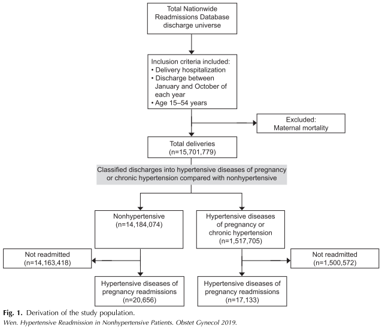
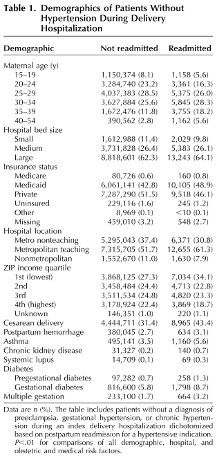
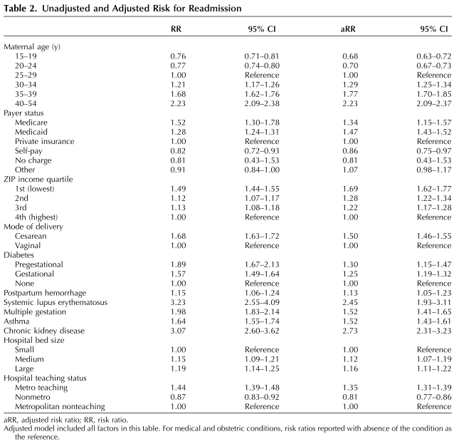
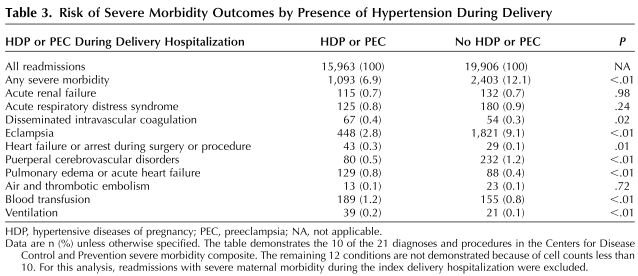

## タイトル
Hypertensive Postpartum Admissions Among Women Without a History of Hypertension or Preeclampsia  
高血圧または妊娠高血圧腎症の既往のない女性における高血圧の産後入院

## 著者/所属機関
Wen, Timothy, MD, MPH; Wright, Jason D., MD; Goffman, Dena, MD; D'Alton, Mary E., MD; Attenello, Frank J., MD; Mack, William J., MD; Friedman, Alexander M., MD, MPH  
Department of Obstetrics and Gynecology, Columbia University Irving Medical Center, New York, New York; and the Department of Neurological Surgery, Keck School of Medicine of the University of Southern California, Los Angeles, California.

## 論文リンク
10.1097/AOG.0000000000003099

## 投稿日付
Originally published: March 11, 2019  
Received September 20, 2018  
Received in revised form November 26, 2018  
Accepted November 29, 2018

## 概要
### 目的
出産入院中に高血圧と診断されなかった高血圧徴候のために分娩後に再入院した女性の危険因子、一時性、および転帰を分析すること。

### 方法
出産中に高血圧の診断を受けていない女性のうち、出産後の退院から60日以内の妊娠高血圧腎症および高血圧による再入院のリスクを評価したコホート研究。  
産後再入院に関連する産科的、医学的、人口統計学的、および病院の因子を分析した。  
未調整分析と調整分析の両方を行った。  
リスクは95％CIの未調整および調整リスク比として特徴付けられた。  
副次転帰として、再入院中の重度の母体罹患率のリスクも、出産入院中の高血圧診断のある女性とない女性を比較して評価された。

### 結果
* 出産時に高血圧と診断されていない場合、高血圧の適応症に対する60日以内の絶対再入院率は低かった。
* 全体:687人に1人  
35-39歳:498人に1人  
40-54歳:337人に1人  
Medicaid:601人に1人  
Medicare:506人に1人  
帝王切開:497人に1人  
産後出血:600人に1人  
妊娠糖尿病/妊娠前からの糖尿病:45人に1人/378人に1人  
喘息:428人に1人  
慢性腎疾患:225人に1人  
狼瘡:214人に1人
* 副次転帰としては、出産中に高血圧の徴候がない女性の方が、高血圧の診断を受けた女性よりも、重度の母体罹患のリスクが高かった（12.1％ vs 6.9％、P <0.01）。

### 結論
出産時に高血圧の診断のない女性が産後に高血圧で再入院するリスクは低かった。

### 図1 研究対象の人口統計

### 表1 分娩入院中の高血圧のない患者の人口統計

### 表2 再入院の未調整および調整済みリスク

### 表3 分娩中の高血圧の存在による重度の罹患率転帰のリスク

