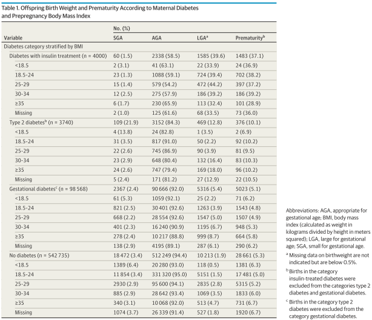
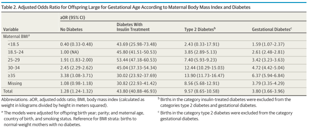
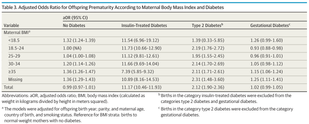
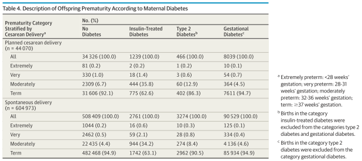
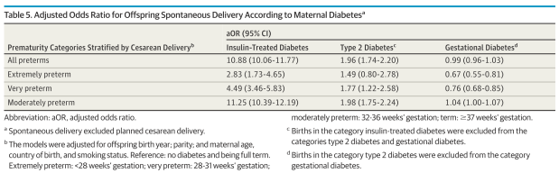

## タイトル
Associations of Maternal Diabetes and Body Mass Index With Offspring Birth Weight and Prematurity  
母親の糖尿病およびBMIと子供の出生時体重および未熟児の関連

## 著者/所属機関
Linghua Kong, MSc 1,2; Ida A. K. Nilsson, PhD 1,2; Mika Gissler, PhD 3,4,5; Catharina Lavebratt, MSc, PhD 1,2  
1 Department of Molecular Medicine and Surgery, Karolinska Institutet, Stockholm, Sweden  
2 Neurogenetics Unit, Center for Molecular Medicine, Karolinska University Hospital, Stockholm, Sweden  
3 National Institute for Health and Welfare, Helsinki and Oulu, Finland  
4 Division of Family Medicine, Department of Neurobiology, Care Sciences and Society, Karolinska Institutet, Stockholm, Sweden  
5 University of Turku, Research Centre for Child Psychiatry, Turku, Finland

## 論文リンク
10.1001/jamapediatrics.2018.5541

## 投稿日付
Published online February 25, 2019

## 概要
### 目的
子供がLGAおよび/または早産の時、母体の糖尿病性障害と母体の体重不足/肥満との関連を別々に検討すること。

### 研究デザイン
* 人口ベースのコホート研究。2004-2014年（11年間）のフィンランドの全出生（n＝649,043）を使用してデータ解析を行った。
* 妊娠前のBMI、インスリン治療中の妊娠前糖尿病、インスリン治療を受けていない妊娠前2型糖尿病、および妊娠糖尿病との相関を対象とした。
* 子供のLGAまたは早産を調査した。ロジスティック回帰モデルは、子供の生年月日、母親の年齢、出生国、および喫煙状況に対して調整。

### 結果
* 649043人の出生のうち、4000人（0.62％）はインスリン治療中の糖尿病、3740人（0.57％）は2型糖尿病、98568人（15.2％）は妊娠糖尿病の患者であった。
* 母親の平均年齢（SD）は30.15（5.37）歳で、588,100人（90.6％）がフィンランドで出生した。
* 子のLGAおよび未熟児と母体BMIおよび糖尿病との間に有意な関係があった  
（インスリン治療糖尿病：LGA児F＝3489.0、および未熟児F＝1316.4\[P<0.001\];  
2型糖尿病：LGA児F＝147.3、未熟児F＝21.9\[P<0.001\];  
妊娠糖尿病：LGA児F＝1374.6、未熟児F＝434.3\[P<0.001\]）。
* 糖尿病のない標準体重の母体（5151\[1.5％\]）と比較して、  
中等度の肥満：LGAのリスクが軽度に増加（1069\[3.5％\]; 調整オッズ比\[aOR\] 2.45; 95％CI 2.29-2.62）。  
インスリン治療糖尿病：LGAのリスクが著しく増加（1585\[39.6％\]; aOR 43.80; 95％CI 40.88-46.93）。  
　　〃　　：早産のリスクが著しく増加（1483\[37.1％\]vs17481\[5.0％\]; aOR 11.17; 95％CI 10.46-11.93）。  
2型糖尿病を伴う中等度の肥満：LGAのリスクが増加（132\[16.4％\]; aOR 12.44; 95％CI 10.29-15.03）。  
　　〃　　：未熟児のリスクが増加（83\[10.3％\]vs17481\[5.0％\]; aOR 2.14; 95％CI 1.70-2.69）。  
妊娠糖尿病を伴う中等度の肥満：LGAのリスクが軽度に増加（1195\[6.7％\]; aOR 4.72; 95％CI 4.42-5.04）。  
* 自然分娩の場合、リスクは中等度の早産に関して最も高かったが、インスリン治療糖尿病の場合、早期早産でもリスクの増加と関連していた。

### 結論
インスリン治療糖尿病は、LGAおよび早産のリスクが著しく増加し、2型糖尿病を伴う肥満は軽度から中等度のリスク増であった。

### 表1 母体の糖尿病および妊娠前妊娠BMIによる出生時体重および未熟児

### 表2 母体のBMIと糖尿病によるLGAの調整オッズ比

### 表3 母体のBMIと糖尿病による未熟児の調整後オッズ比

### 表4 母体の糖尿病による未熟児の説明

### 表5 母体の糖尿病による自然分娩の調整オッズ比

