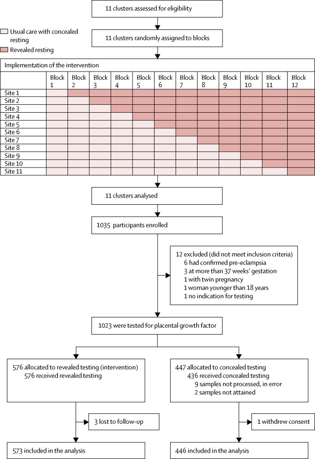

## タイトル
Placental growth factor testing to assess women with suspected pre-eclampsia: a multicentre, pragmatic, stepped-wedge cluster-randomised controlled trial  
妊娠高血圧腎症の疑いのある妊娠女性を評価するための胎盤増殖因子試験：多施設、実用的、段階的クラスター無作為化対照試験

## 著者/所属機関

## 論文リンク
https://doi.org/10.1016/S0140-6736(18)33212-4

## 投稿日付
Published:April 01, 2019

## 概要
### 目的
臨床管理アルゴリズムと統合された血管新生因子である胎盤増殖因子（PlGF）の血中濃度の知識が、妊娠高血圧腎症の疑いのある女性において臨床医が診断を下すまでの時間を短縮したかどうか、そしてこのアプローチがその後の母体または周産期の有害転帰を減少させたかどうかを決定すること。

### 方法
英国の11の産科施設で多施設、実際的、段階的クラスター化無作為化対照試験を実施し、それぞれが年間3000〜9000の分娩を担当した。  
妊娠20週0日から妊娠36週6日の間に妊娠高血圧腎症が疑われる18歳以上の女性が、臨床研究チームによって招待されました。  
妊娠高血圧腎症の疑いは、既存の高血圧症、ディップスティックタンパク尿、上腹部または右上象限疼痛、視覚障害のある頭痛、胎児発育不全、または疾患を示唆する異常な母体血液検査（血小板減少症、肝機能障害、腎機能障害など）の新規発症または悪化と定義された。  
女性は個別にアプローチされ、彼らは研究の包含に同意した。  
そして彼らは血液サンプルを与えるように頼まれた。  
クラスターを表す出生単位をブロックにランダムに割り当てました。  
ブロックは介入開始時間を表し、これは試験を通して6週間の間隔で等間隔で発生した。  
試験開始時には、すべてのユニットが通常の治療を受けていました（この中でPlGF測定も行われましたが、臨床医や女性からは隠されていました）。  
各連続ブロックの開始時に、サイトが介入を使用し始めた（その中で血中PlGF測定値が明らかにされ、臨床管理アルゴリズムが使用された）。  
ブロックの期間中、女性の登録はPlGFテストを隠すため、または施行後、PlGFテストを明らかにするために続けられた。  
主な結果は、治療を受けている臨床医によって妊娠高血圧腎症の診断を受けた試験に登録された女性における妊娠高血圧腎症の疑いのある提示から文書化された妊娠高血圧腎症までの時間であった。

### 調査結果
2016年6月13日から2017年10月27日の間に、妊娠高血圧腎症が疑われる1035人の女性を登録し、評価しました。  
12人（1％）の女性が不適格であることが判明した。  
適格な1023人の女性のうち、576人（56％）の女性が介入（顕示検査）グループに割り当てられ、447人（44％）の女性が追加の隠されたテスト（隠されたテストグループ）で通常のケアを受けることに割り当てられた。 
明らかにされた試験グループの3人（1％）の女性が追跡調査に失敗したため、このグループの573人（99％）の女性が分析に含まれた。  
隠されたテストグループの1人の女性（<1％）が追跡データ収集の同意を撤回したため、このグループの女性446人（> 99％）が分析に含まれた。  
妊娠高血圧腎症と診断されるまでの期間の中央値は、隠れた試験で4.1日、明らかにした試験で1.9日であった（時間比0.36、95％CI 0.15-0.87; p = 0.027）。  
対 14％、1.45、0.73-2.90）または分娩における妊娠（36.6週対 36.8週間; 95％CI -0.63 73.0に、差分-0.52を意味します） 。
妊娠高血圧腎症と診断されるまでの期間の中央値は、隠蔽検査で4。1日、検査検査で1。9日であった（時間比0.36、95％CI 0.15-0.87; p = 0 027）。
隠れテストグループの女性447人中、24人（5％）vs明らかにされた試験グループの573人の女性のうち22人（4％）に母体の重篤な有害転帰が報告された（調整オッズ比0・32、95％CI 0.11〜0.96； p = 0.043）が、周産期の有害転帰（15％対14％、1.45、0.73-290）または出産時の妊娠（36.6週vs 36.8週；平均差−0.52、95％CI −0.63〜0.73）に差があるという証拠はなかった。

### 解釈
我々は、PlGF試験結果の利用可能性が妊娠高血圧腎症の臨床的確認までの時間を実質的に短縮することを見出した。  
臨床医のための臨床管理アルゴリズムで推奨されているように、PlGFが実施されたところで、我々は、標的化された強化されたサーベイランスの採用と一致して、より低い母体有害転帰の発生率を見出した。  
妊娠高血圧腎症が疑われる女性におけるPlGF試験の採用は、この研究の結果によって支持されている。

### 図1 トライアルプロファイル

### 図2 臨床医から血中胎盤増殖因子濃度を明らかにした場合と隠した場合の妊娠高血圧腎症と診断された女性の割合（日数（A）および数週間（B））

