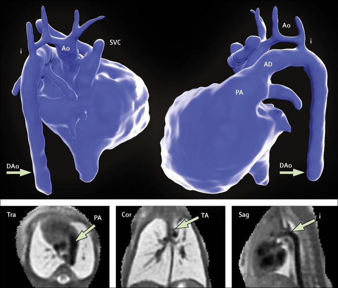

## タイトル
Three-dimensional visualisation of the fetal heart using prenatal MRI with motion-corrected slice-volume registration: a prospective, single-centre cohort study  
動き補正スライスボリュームレジストレーションを用いた出生前MRIを用いた胎児心臓の三次元可視化：前向き単一施設コホート研究

## 著者/所属機関
David F A Lloyd, MPhil, 1 2, Kuberan Pushparajah, MD, 1 2, Prof John M Simpson, MD, 2, Joshua F P van Amerom, BASc, 1, Milou P M van Poppel, MD, 1, Alexander Schulz, 1, Bernard Kainz, PhD, 1 3, Maria Deprez, PhD, 1, Maelene Lohezic, PhD, 1, Joanna Allsop, 1, Sujeev Mathur, MD, 2, Hannah Bellsham-Revell, MD, 2, Trisha Vigneswaran, MRCPCH, 2, Marietta Charakida, PhD, 2, Owen Miller, MD, 2, Vita Zidere, MD, 2, Prof Gurleen Sharland, MD, 2, Prof Mary Rutherford, MD, 1, Prof Joseph V Hajnal, PhD, 1, Prof Reza Razavi, MD, 1 2  
1 School of Biomedical Engineering & Imaging Sciences, King's College London, King's Health Partners, St Thomas' Hospital, London, UK
2 Department of Congenital Heart Disease, Evelina London Children's Hospital, Guy's and St Thomas' NHS Foundation Trust, London, UK
3 Department of Computing (BioMedIA), Imperial College London, London, UK

## 論文リンク
https://doi.org/10.1016/S0140-6736(18)32490-5

## 投稿日付
Published:March 22, 2019

## 概要
### 目的
先天性心疾患の診断における胎児心エコー検査の補助として、出生前MRIと新規技術の動き補正3D画像レジストレーションソフトウェアとの組み合わせを調査すること。

### 方法
* 三次施設を受診した胎児の先天性心疾患が疑われる妊娠女性。
* 比較のため、連続した2D MRI画像をオープンソースを改良した独自ソフトウェアを用いて3Dモデルを作成した。
* これらのデータセットを評価した。
  * 2D超音波の比較
  * 2Dおよび3Dデータの解剖学的評価
  * 同時に保存されたMRIの臨床所見
  * 出生後の所見との比較

### 結果
* 2015年10月8日-2017年6月30日に、101人の患者がMRI検査を受け、85人が適格であり胎児MRIを受けた。
* MRI時点での平均在胎数は32週（24-36歳の範囲）であった。
* 全症例で胎児胸部の高解像度（0.50–0.75mm isotropic）3Dデータセットが作成された。
* 血管測定は、補正されていない2D MRI（解剖学的領域680のうち、657 \[97％\] vs 358 \[53％\]; p＜0.0001）よりも3D MRIでより効果的に視覚化された胎児血管構造を用いて、ペアデータを有する51症例（クラス内相関係数0.78、95％CI 0.68-0.84）において、2D心エコー検査と良好な全体的一致を示した。
* 2Dおよび3Dデータの両方で視覚化されたとき（n＝358）、観察者は321症例（90％）において3Dデータに対してより高い診断品質スコアを与え、37症例（10％）のスコアは2Dデータと結び付けられ、2Dデータよりも低いスコアはなかった（Wilcoxonの符号順位検定 p＜0.0001）。
* 10症例は追加で解剖学的に特徴付けられ、出生後に確認された。

### 結論
標準的な胎児MRIは、胎児血管系の高解像度3D画像を生成することが可能であり、生成された3Dボリュームは超音波との良好な空間的一致を示し、補正されていない2D MRIデータと比較して可視化、および診断品質が著しく改善した。

### 図1 心エコー検査（A）とMRI（B）のための2人の独立した観察者からの測定値を比較する散布図

### 図2 解剖学的カテゴリーによって示される、2人の独立した観察者からの構造化解剖学的評価の結果

### 図3 32週時の二重大動脈弓を有する胎児からの運動補正MRIデータ

### 図4 心エコー検査で右肺静脈異常のために紹介された33週の胎児における動き補正3Dデータからのセグメンテーションの例

### 図5 肺動脈閉鎖症および心室中隔欠損、右大動脈弓、および切断された肺動脈を有する胎児における32週目の3Dデータからの胎児心臓のセグメンテーション

### 図6 妊娠33週での大動脈の縮縮が疑われる胎児の運動補正MRIデータのセグメンテーション

