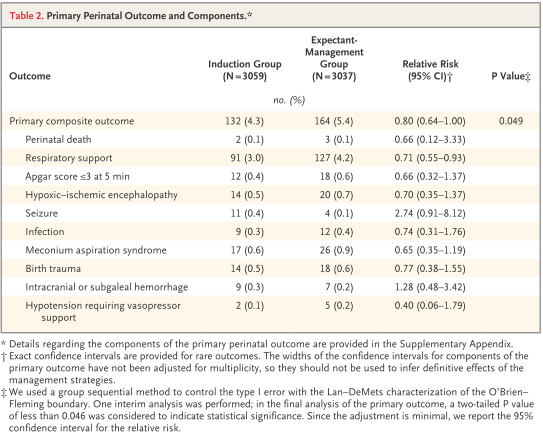

## タイトル
Labor Induction versus Expectant Management in Low-Risk Nulliparous Women  
低リスク未産婦における分娩誘発と待機的管理との比較

## 著者/所属機関
William A. Grobman, M.D., Madeline M. Rice, Ph.D., Uma M. Reddy, M.D., M.P.H., Alan T.N. Tita, M.D., Ph.D., Robert M. Silver, M.D., Gail Mallett, R.N., M.S., C.C.R.C., Kim Hill, R.N., B.S.N., Elizabeth A. Thom, Ph.D., Yasser Y. El-Sayed, M.D., Annette Perez-Delboy, M.D., Dwight J. Rouse, M.D., George R. Saade, M.D., Kim A. Boggess, M.D., Suneet P. Chauhan, M.D., Jay D. Iams, M.D., Edward K. Chien, M.D., Brian M. Casey, M.D., Ronald S. Gibbs, M.D., Sindhu K. Srinivas, M.D., M.S.C.E., Geeta K. Swamy, M.D., Hyagriv N. Simhan, M.D., and George A. Macones, M.D., M.S.C.E. for the Eunice Kennedy Shriver National Institute of Child Health and Human Development Maternal–Fetal Medicine Units Network

## 論文リンク
10.1056/NEJMoa1800566

## 投稿日付
August 9, 2018

## 概要
### 目的
低リスク未産婦における妊娠39週での分娩誘発が周産期や母体に及ぼす影響を明らかにすること。

### 方法
* 多施設共同試験で、妊娠38週0日～38週6日の低リスク未産婦を、以下の2群に無作為に割り付けた。
  * 妊娠39週0日～39週4日で分娩誘発を実施
  * 待機的管理
* 主要評価項目
  * 周産期死亡または重度の新生児合併症の複合
* 副次的評価項目
  * 帝王切開

### 結果
* 3,062例を分娩誘発群，3,044例を待機的管理群に割り付けた。
* 主要転帰は、誘発群の新生児の4.3％と待機的管理群の新生児の5.4％に発生した（相対リスク 0.80、95%信頼区間 \[CI\] 0.64-1.00）。
* 帝王切開の頻度は、誘発群のほうが待機的管理群よりも有意に低かった（18.6％ vs 22.2％、相対リスク 0.84、95％CI 0.76-0.93）。

### 結論
低リスク未産婦における妊娠39週での分娩誘発によって、周産期の複合有害転帰の頻度は有意には低下しなかったが、帝王切開の頻度は有意に低下した。

### 図1

### 表1

### 表2

### 表3

### 図2

