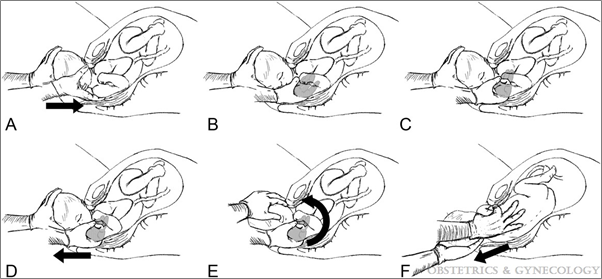

## タイトル
New Technique: Shoulder Shrug Maneuver for Delivery During Shoulder Dystocia  
新しいテクニック：肩甲難産のための肩の娩出の手技

## 概要
### 背景と目的
* Sancetta、Khanzada、およびLeante（Obstetrics＆Gynecology、2019年）は、McRoberts法失敗した場合に行う、肩の娩出の手技について説明しています。
### 方法：
* 新技術の3つのケーススタディ
* 技術
  * 肩の後部をすくめて、肩甲難産を解決するために頭 - 肩ユニットを180度回転させます
#### 6ステップのテクニック
ビデオを参照してください。(AOG_133_6_2019_05_16_SANCETTA_19-69_SDC7.mov)  
* 産科医の親指と人差し指を使って腋窩の後部肩をつかみます
* 頭に向かって腋窩を引き出し、膣口に向かって肩を引き込むことで肩をすくめます
* つかんだ状態を維持し、反対側の手で頭と引き込まれた肩を1つのユニットとして一緒に保持します。
* このユニットを新生児の顔の方向に180度回転させます
* 顔に向かって回転することが不可能である場合、顔から反対方向に回転することを試みることができる。
* 肩が後ろにある場合、すくめた肩を前方に動かす
* すくめた肩を抜いた後、残った方の肩を抜くことができる。
### 結果：
McRoberts法と恥骨上部圧迫法失敗時の肩甲の抜き方
#### 患者1
* 46歳 | 以前の経膣分娩
* 次の肩をすくめる操作の分娩は合併症なしで進みました
  * アプガー：9点(1分)、9点(5分)
  * 新生児怪我：なし
  * 母体の怪我：一度会陰裂傷
#### 患者2
* 37歳 | 以前のVBAC
* 肩をすくめた手技後の分娩は、合併症なしに進行した（ただし、顔から離れる反対方向への回転が必要）。
  * アプガー：9点(1分)、9点(5分)
  * 新生児の傷害：軽度の左腕神経叢麻痺、2週間以内に治癒  
#### 患者3
* 28歳 | 肩甲難産
* 次の肩をすくめる操作の分娩は合併症なしで進みました
  * アプガー：9点(1分)、9点(5分)
  * 新生児怪我：なし
  * 母体の怪我：二度会陰裂傷
### 結論：
* 著者らは、この操作はシミュレーション訓練中に容易に学ぶことができると結論付け、さらに次のように述べている。
  > 肩の娩出の手技は、産科医の肩甲難産の管理に追加できるテクニックです。

### 図1

## リンク
https://www.obgproject.com/2019/06/05/new-technique-shoulder-shrug-maneuver-for-delivery-during-shoulder-dystocia/
