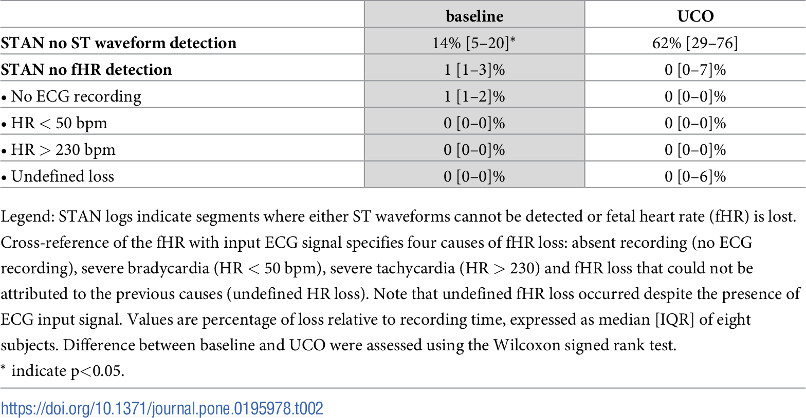

## タイトル
ST waveform analysis for monitoring hypoxic distress in fetal sheep after prolonged umbilical cord occlusion  
長時間の臍帯閉塞後の胎仔ヒツジにおける低酸素仮死を監視するためのST波形解析

## 著者/所属機関

## 論文リンク
https://doi.org/10.1371/journal.pone.0195978

## 投稿日付
Received: July 24, 2017  
Accepted: April 3, 2018  
Published: April 16, 2018

## 概要
### 目的
長時間の臍帯閉塞（UCO）にさらされた胎仔ヒツジモデルにおける信号処理および低酸素血症の検出における臨床STAN装置の性能を評価すること。

### 方法
胎仔ヒツジ8匹を25分のUCOに曝露した。  
ベースライン期間中およびUCO中にECG記録を分析した。  
STANイベント率およびエピソード的T / QRS上昇、ベースラインT / QRS上昇および二相性ST波形の発生のタイミング、ならびにシグナル損失を評価した。

### 結果
正常酸素血症のベースライン状態では、1分あたり40（IQR、25〜70）STAN-イベントの中央値が検出されましたが、UCOでは10（IQR、2〜22）でした。  
UCO中に、10分以内に5匹に、18分後に6匹にそれぞれイベントが検出された。  
2匹はUCOの間にいかなるSTAN-イベントも生成しなかった。  
ベースライン（中央値32、IQR、6-55）と比較して、二相性STイベント発生率はUCO（中央値0、IQR 0-5）の間に減少しました。  
良好な品質のECG信号にもかかわらず、ST波形は、UCOの間の記録時間の62％で評価することができなかった。

### 結論
STAN装置は、長時間のUCO後の胎仔ヒツジにおける低酸素血症の検出において限界を示した。  
STAN装置は、ベースライン中に高い偽陽性事象率を生じさせ、そして長時間の胎仔低酸素血症後にT / QRS変化を適切に検出しなかった。  
ベースラインの14％およびUCO期間の62％の間、STAN装置は、良好な品質の信号にもかかわらず、ECG信号を処理することができなかった。  
これらの問題を解決することは、STAN装置の臨床的性能を改善するかもしれない。

### 図1.正常酸素血症および低酸素血症時の血液ガス分析

### 図2.正常酸素血症および低酸素血症時の血圧と心拍数の反応

### 図3.正常酸素血症および低酸素血症時のSTANイベント

### 表1.ベースライン時および胎児低酸素血症時の発症率

### 図4.胎児低酸素時のSTANイベント警告

### 図5.被験者3の臍帯閉塞中にSTANモニターが何らかのSTイベントを検出できなかった例

### 表2.すべての被験者におけるSTAN録音の信号損失

### 表3.全被験者における入力心電図信号の欠如

## コメント
著者はSTANは未だ偽陽性率、偽陰性率が高く改良の余地が残されていると結論づけている。  
しかし、分娩監視装置（FHR、TOCOのみ）と同じ指標で偽陽性率が高いと論じているわけではなく、計測全区間通じて何％評価できたかを論じている。
