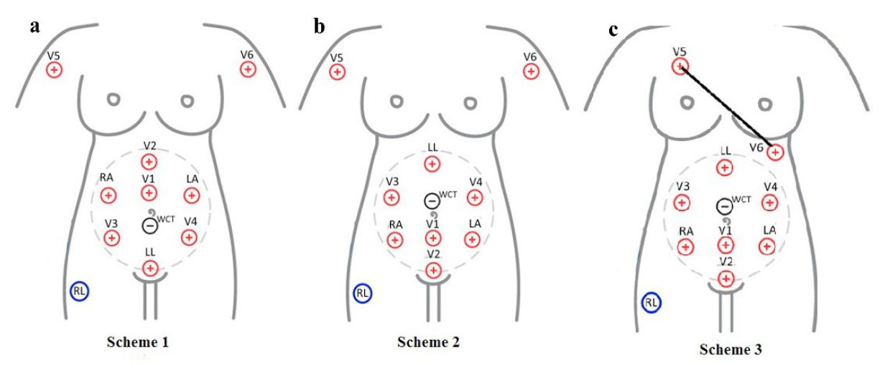
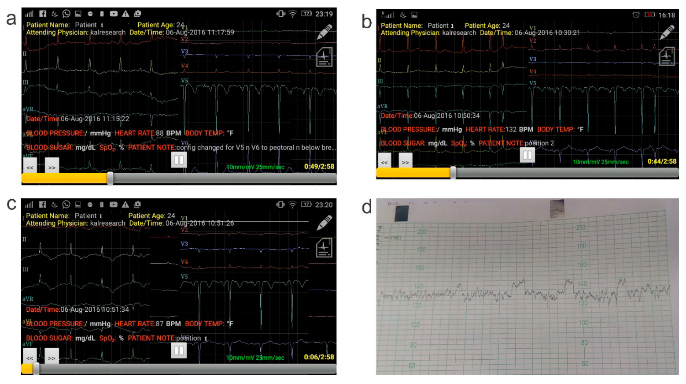

## タイトル
ECG Electrode Configuration to Extract Real Time FECG Signals  
リアルタイムFECG信号を抽出するためのECG電極構成

## 著者/所属機関

## 論文リンク
https://doi.org/10.1016/j.procs.2017.12.065

## 投稿日付
7-8 December, 2017
(6th International Conference on Smart Computing and Communications, ICSCC 2017)

## 概要
### 目的
FECG信号を得るために、母体の腹部にECG電極を配置するための最適なポイントを見つけること。

### 提案手法
標準的な12リードECGマシンを使用して、電極配置の3つのスキームを提案しました。
この構成は、右脚リード（黒）が右腿に配置され、他の4本のリードが胎児の周囲に配置されているIEC 60601-2-51規格による商用5リード胎児ECGのリード構成に基づいています。
クリニックでは、看護師はアルコールで腹部の皮膚をきれいにし、表面電極が配置される領域の周りの乾燥した皮膚を避けました。  
皮脂を除去すると、電極の導電性がさらに向上します。

### 結果
母親は24歳で、妊娠期間は34週5日で胎位は頭位でした。  
上図に示す各電極位置について、18分間の記録を行いました。  
実験は、Mobmonと呼ばれる標準の12誘導安静ECGレコーダーを使用して、3つのモードで実施されました。  
デバイスには、リモートの医師の電話にライブECGストリームを送信する機能がありました。  
最初に、スキーム1を数分間徹底的にテストしてから、各スキームをそれぞれ18分間記録するように設定しました。  
最大の胎児ECG振幅は、2番目のスキーム中に記録され、1時間前に撮影されたCTG記録と同様の平均FHR値が132 bpmとなります。  
母体の信号は、母親の心拍数のみを表示する他の2つのスキームのFECGよりも強かった。  
3つのスキーム1、2、3の記録は、それぞれ下図（a）、（b）、（c）に表示され、被験者のCTG読み取り値は下図（d）に示されています。

### 議論
この論文では、最良の電極位置構成にアクセスするために、単一の妊婦からaECG信号を収集するために実験記録が行われました。  
私たちの実験では、胎児が小さすぎ、小さな心臓が非常に弱かったため、aECGを介して取得した母体信号と比較して、FECG信号は非常に小さいことがわかりました。  
この母体胎児振幅比は、nifecgdb（オンラインデータベースレコード）の場合とほぼ同じです。  
MECGの振幅は、胎児の振幅と比較して非常に大きくなっています。  
さらに、ノイズはaECG信号を無効にし、胎児信号をaECGから分離することをさらに困難にします。  
最高の録音は、通常のサイズの赤ちゃんを持つ満期近くの母親のものです。  
スキーム2がCTGを使用して得られた平均FHRに近い平均FHR値を持つ最良の結果をもたらし、スキーム1および3はMHR値を与えたことが観察されました。  
これは、リード線が互いに非常に近接して配置されている可能性があるためです。  
次の実験では、WCTからのリード線の距離（電極間距離）を変化させることができ、腹部周囲も変化させることができます。  
FECGをMECGから分離するために、生の測定値を処理する前に、データベース内の赤ちゃんのECGピークと同等の高さを得るために、より多くの位置を調査できます。  
将来的にの作業と、より良い品質のFECG信号を取得するために提案されたスキームを強化するために、3つのスキームすべて、特にスキーム2の18分間の妊娠第37週から少なくとも各25人の被験者を検査することを提案します。  
CTGの読み取り（クリニックから）および本方法を使用した胎児の心拍数の変動は、被験者ごとに比較できます。  
上記のすべての被験者の胎児の健康状態は、出産まで毎週監視することができ、出生時の新生児の健康状態と相関させることができます。

## コメント
計測結果を見てもどこに胎児成分が含まれているのかわからない。
