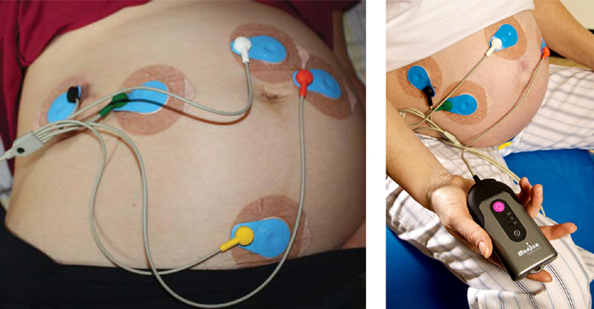

## タイトル
Accuracy and Reliability of Uterine Contraction Identification Using Abdominal Surface Electrodes  
腹壁電極を使用した子宮収縮識別の正確性と信頼性

## 著者/所属機関

## 論文リンク
https://doi.org/10.4137/CMWH.S10444

## 投稿日付
First Published December 4, 2012

## 概要
### 目的
母体腹壁筋電図と陣痛トランスデューサの子宮収縮識別の正確性と信頼性を子宮内圧デバイスと比較すること。

### 方法
74人の分娩が迫った妊婦の子宮収縮を、子宮筋電図、陣痛トランスデューサ、子宮内圧デバイスを用いて同時にモニターした。

### 結果
子宮内圧デバイスと比較した場合、子宮筋電図は陣痛トランスデューサより信頼性が高かった（97.1対60.9の肯定的な一致率、P <0.001）。  
二乗平均平方根誤差は、
* 分娩第1期：子宮筋電図の方が少ない（0.88 vs 1.22 収縮/10分; P<0.001）
* 分娩第2期：同等

陣痛トランスデューサおよび子宮筋電図の
* 陽性適中率（84.1％ vs 78.7％、有意差なし）
* 偽陽性率（21.3％ vs 15.9％; P = 0.052、有意差なし）

子宮筋電図の感度は、陣痛トランスデューサよりも優れていた（86.0 vs 73.6％、P <0.001）。

### 結論
子宮筋電図は、分娩中の子宮収縮の検出において、より信頼性が高く、正確性が陣痛トランスデューサと同等であった。

### 図1. 電極

