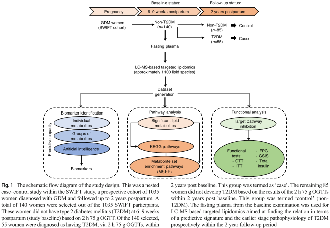
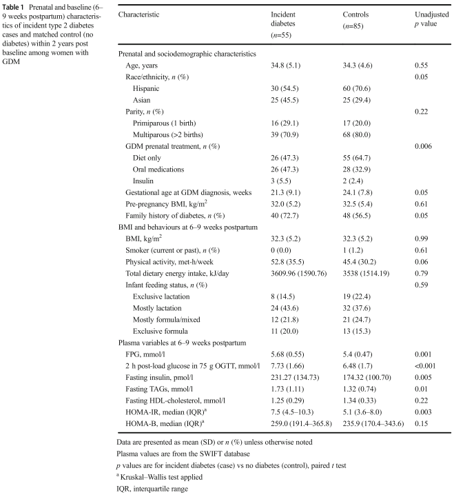
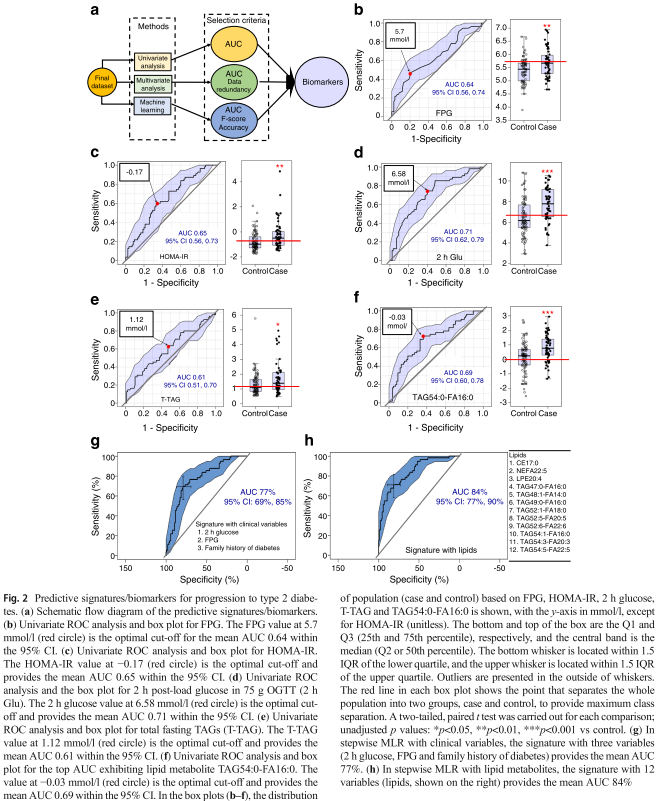
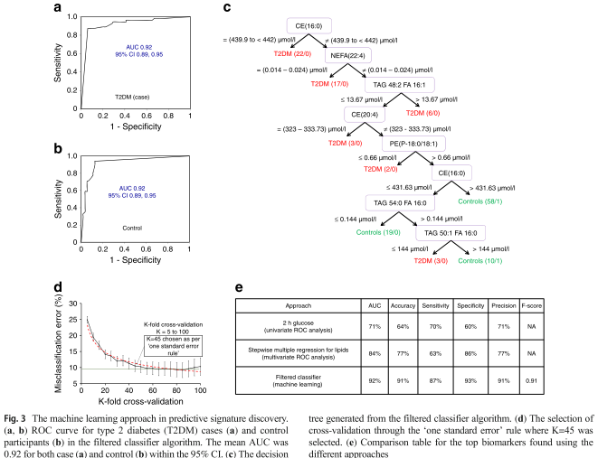
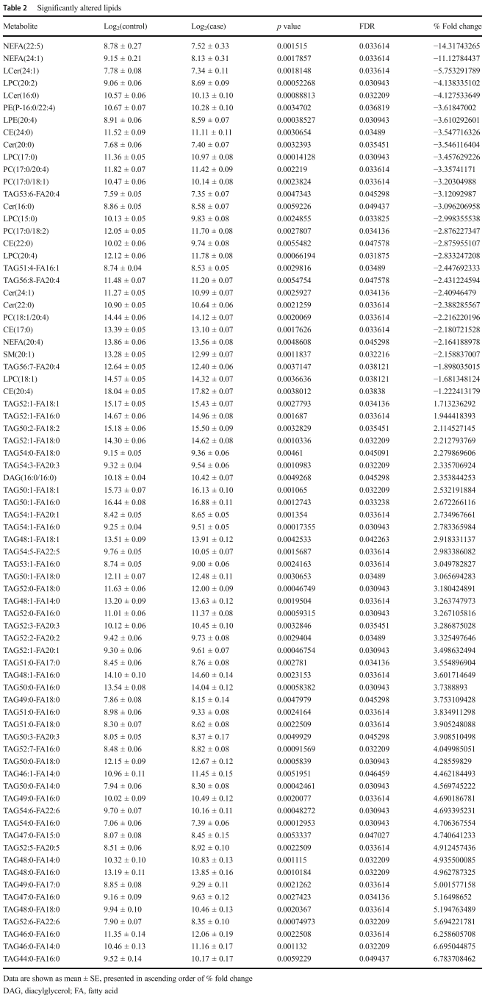
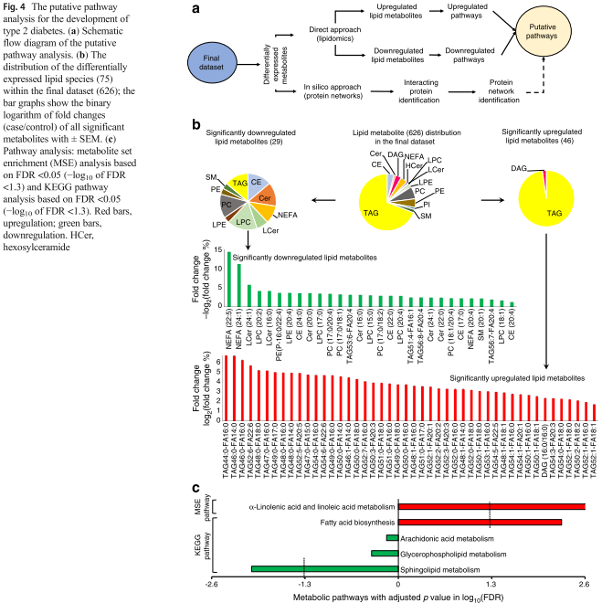
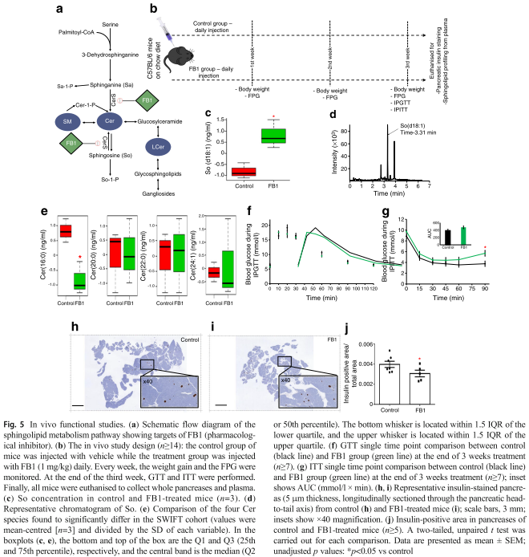
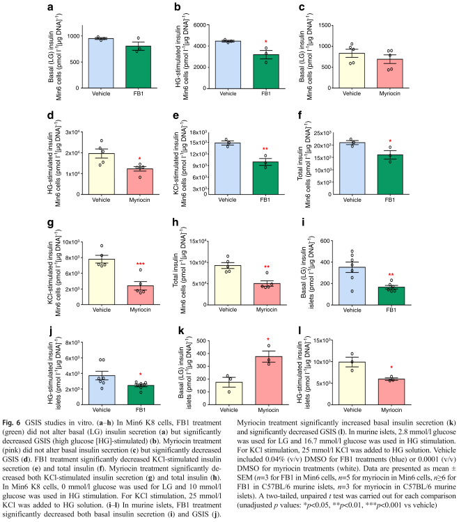

## タイトル
The discovery of novel predictive biomarkers and early-stage pathophysiology for the transition from gestational diabetes to type 2 diabetes  
妊娠糖尿病から2型糖尿病への移行のための新規予測バイオマーカーと早期病態生理学の発見

## 著者/所属機関
Saifur R. Khan 1 2, 
Haneesha Mohan 1 2, 
Ying Liu 1 2, 
Battsetseg Batchuluun 1 2, 
Himaben Gohil 1 2, 
Dana Al Rijjal 1 2, 
Yousef Manialawy 1 2, 
Brian J. Cox 3 4, 
Erica P. Gunderson 5, 
Michael B. Wheeler 1 2  
1.Endocrine and Diabetes Platform, Department of Physiology, University of Toronto, Toronto, Canada  
2.Advanced Diagnostics, Metabolism, Toronto General Hospital Research Institute, Toronto, Canada  
3.Reproduction and Development Platform, Department of Physiology, University of Toronto, Toronto, Canada  
4.Department of Obstetrics and Gynecology, University of Toronto, Toronto, Canada  
5.Kaiser Permanente Northern California, Division of Research, Oakland, USA

## 論文リンク
https://doi.org/10.1007/s00125-018-4800-2

## 投稿日付
Received: 26 July 2018  
Accepted: 13 November 2018  
First Online: 15 January 2019

## 概要
### 目的
GDMから2型糖尿病への移行に関する予測的特徴と早期病態生理学の両方を特定すること。

### 方法
GDM妊娠歴のある女性を対象とした前向きコホート研究。分娩後6〜9週に75g/2時間のOGTTにより糖尿病ではないことを確認し（ベースライン）、毎年2型糖尿病の検査を実施した（2年間の追跡調査）。大規模な標的化リピドーム研究を実施して、ネステッドペアマッチ症例対照デザインを使用してベースライン血漿試料中の約1100個の脂質代謝産物を分析し、55人のインシデント症例を85人の非症例対照参加者と一致させた。ベースライン血漿脂質の濃度とそれぞれの経過観察状態（2型糖尿病または2型糖尿病なし）との間の関係を用いて、GDMから2型糖尿病への移行の予測シグニチャおよび根底にある病態生理学の両方を発見した。 さらに、根底にある病態生理学をインビボおよびインビトロで調べた。

### 結果
Weka 3.8ソフトウェアを使用し、デシジョンツリー形式での機械学習の最適化を行った。識別力（AUC）が0.92（感度87％、特異度93％、精度91％）の7脂質代謝物の2型糖尿病予測シグネチャを明らかにした。このシグネチャは、信頼度の高いしきい値（1.0）およびバイナリ出力の下で45倍のクロスバリデーションが行われるため、非常に堅牢で、データの過剰適合やバイアス選択の可能性が最小限に抑えられている。差次的に発現された脂質代謝産物経路の同時分析は、将来の2型糖尿病を発症するリスクと強く関連しているとして、α-リノレン酸/リノール酸代謝（誤発見率[FDR] 0.002）および脂肪酸生合成（FDR 0.005）の上方制御、スフィンゴ脂質代謝の下方制御（FDR 0.009）を明らかにした。将来の2型糖尿病を発症するリスクがあります。特にスフィンゴ脂質に注目すると、マウス膵島およびMin6 K8細胞（膵臓β細胞様細胞株）における薬理学的阻害剤フモニシンB1（FB1）およびミリオシンを用いたスフィンゴ脂質代謝の下方制御はグルコース刺激インスリン分泌を著しく損なったが、全身のグルコース恒常性やインスリン感受性に大きな影響はなかった。

### 結論
我々は新規予測シグネチャを明らかにし、GDMから2型糖尿病への移行の病態生理学と還元スフィンゴ脂質を関連づける。膵島におけるスフィンゴ脂質代謝の減弱はグルコース刺激によるインスリン分泌を損なう。

### 図1 研究デザインの概略フロー図

### 表1 2型糖尿病の2症例の出生前およびベースライン（産後6〜9週間）の特徴、およびベースライン後2年以内の一致対照（糖尿病なし）のGDM女性

### 図2 2型糖尿病への進行に対する予測的なサイン/バイオマーカー

### 図3 予測シグネチャ発見における機械学習アプローチ

### 表2 大幅に変更された脂質

### 図4 2型糖尿病発症のための推定経路解析

### 図5 in vivo機能研究

### 図6 in vitroでのGSIS研究

